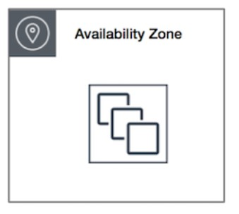
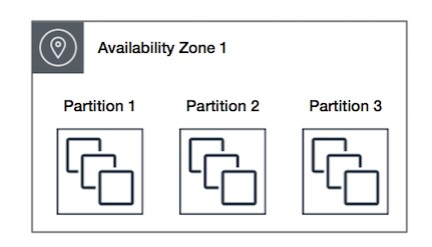
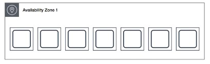
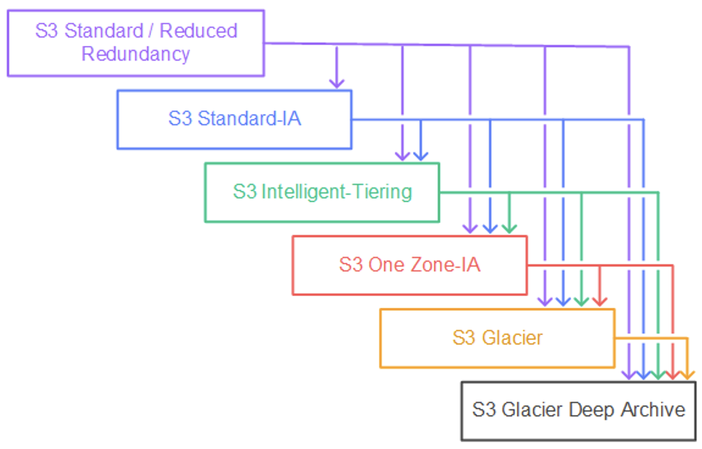
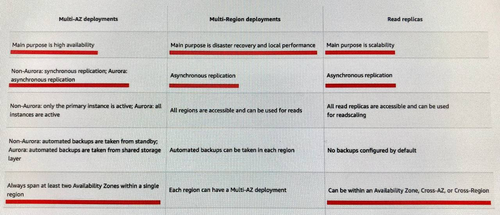
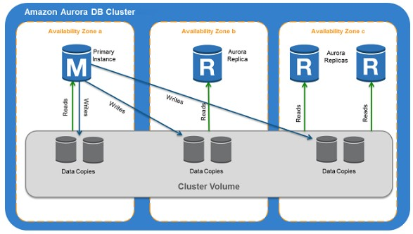

# Exam Prep Notes

## IAM

- IAM permission boundary can only be applied to roles or users, not IAM groups.
- Trust policy: who can assume a role (identity/service)
- Trust policy: define which principal entities (accounts, users, roles, and federated users) can assume the role. An IAM role is both an identity and a resource that supports resource-based policies. For this reason, you must attach both a trust policy and an identity-based policy to an IAM role. The IAM service supports only one type of resource-based policy called a role trust policy, which is attached to an IAM role.
- `AdministratorAccess` managed policy can perform almost all AWS tasks except a few tasks designated only for the root account user. Some of the AWS tasks that only a root account user can do are as follows: change account name or root password or root email address, change AWS support plan, close AWS account, enable MFA on S3 bucket delete, create Cloudfront key pair, register for GovCloud.

## AWS Organizations

- Service control policies (SCPs): manage permissions in your organization.
- If a user or role has an IAM permission policy that grants access to an action that is either not allowed or explicitly denied by the applicable SCPs, the user or role can't perform that action
- SCPs affect all users and roles in attached accounts, including the root user
- SCPs do not affect service-linked role. Service-linked roles enable other AWS services to integrate with AWS Organizations and can't be restricted by SCPs.
- Use AWS CloudFormation StackSets to deploy the same template across AWS accounts and regions. A stack set lets you create stacks in AWS accounts across regions by using a single AWS CloudFormation template.

## AWS Resource Access Manager (RAM)

- service that enables you to easily and securely share AWS resources with any AWS account or within your AWS Organization.

## EC2

- EBS: virtual disk storage (HDD or SSD). Root EBS volume is by default deleted on EC2 termination. You can configure to persist it but to keep data even after EC2 was terminated, use non-root EBS volume or reconfire to persist root volume.
- EBS volumes are AZ locked (you can attach an EBS volume to an EC2 instance in the same AZ).
- user data: executed once on boot (first instance launch but **NOT on re-start** anymore). Uses root user privileges (no need for `sudo`). Any files you create will be owned by root.
- difference between dedicated host and dedicated instance:

    **Dedicated Instance**: The physical machine or underlying hardware is reserved for use for the whole account. You can have instances for different purposes on this hardware. Dedicated instances may share hardware with other instances from the same AWS account that are not dedicated instances.

    **Dedicated Host**: The physical machine or the underlying hardware is reserved for "Single Use" only, eg. a certain application (suitbale for license transfer).
- When the new AMI is copied from region A into region B, it automatically creates a snapshot in region B because AMIs are based on the underlying snapshots. an AMI always has one or more underlying snapshots from which it was created.
- Placement Types:

    **Cluster**: within one AZ (low latency, high throughput)

    

    **Partition**: A partition placement group spreads your instances across logical partitions such that groups of instances in one partition do not share the underlying hardware with groups of instances in different partitions. This strategy is typically used by large distributed and replicated workloads, such as Hadoop, Cassandra, and Kafka. A partition placement group can have a maximum of 7 partitions per Availability Zone. No two partitions within a placement group share the same racks, allowing you to isolate the impact of hardware failure within your application. Since a partition placement group can have partitions in multiple Availability Zones in the same region, therefore instances will not have low-latency network performance. Hence the partition placement group is not the right fit for HPC applications.

    

    **Spread**: each instance is places on a separate hardware. Resilience but no low latency
    Only up to 7 running instances per AZ per group

    

- Instance Store: (1) temporary EBS (can be used for temp caching) AND perfect for data replication across a fleet of instances. provide **high random I/O performance at low cost** and the resilient architecture can adjust for the loss of any instance. An EC2 Instance Store cannot be shared among multiple EC2 instances.
- EBS: HDD and SSD. SSD-backed volumes are optimized for transactional workloads involving frequent read/write operations with small I/O size, where the dominant performance attribute is IOPS. HDD-backed volumes are optimized for large streaming workloads where the dominant performance attribute is throughput. 
- HDD can't be used as boot volumes
- Launch Template vs Launch Configuration: launch configurations are used with Auto Scaling Groups. While launch templates are used when you launch an instance using the aws EC2 console, an AWS SDK, or a command line tool. Launch templates enable you to store the parameters (AMI, instance type, security groups, and key pairs etc.)
- Tenancy: defines how EC2 instances are distributed across physical hardware and affects pricing. There are three tenancy options available:

    **Shared (default)** — Multiple AWS accounts may share the same physical hardware.

    **Dedicated Instance (dedicated)** — Your instance runs on single-tenant hardware.

    **Dedicated Host (host)** — Your instance runs on a physical server with EC2 instance capacity fully dedicated to your use, an isolated server with configurations that you can control.

-  You can only change the tenancy of an instance from dedicated to host, or from host to dedicated after you've launched it.
- Launch Configuration Tenancy vs VPC Tenancy: When you create a launch configuration, the default value for the instance placement tenancy is null and the instance tenancy is controlled by the tenancy attribute of the VPC. If you set the Launch Configuration Tenancy to default and the VPC Tenancy is set to dedicated, then the instances have dedicated tenancy. If you set the Launch Configuration Tenancy to dedicated and the VPC Tenancy is set to default, then again the instances have dedicated tenancy.
- A Spot Instance request is either one-time or persistent. If the spot request is persistent, the request is opened again after your Spot Instance is interrupted. If the request is persistent and you stop your Spot Instance, the request only opens after you start your Spot Instance.
- Spot blocks are designed not to be interrupted.
- Impared EC2 recovery: If your instance has a public IPv4 address, it retains the public IPv4 address after recovery. If the impaired instance is in a placement group, the recovered instance runs in the placement group.  A recovered instance is identical to the original instance, including the instance ID, private IP addresses, Elastic IP addresses, and all instance metadata. During instance recovery, the instance is migrated during an instance reboot, and any data that is in-memory is lost.
- Elastic Fabric Adapter (EFA) is a network device that you can attach to your Amazon EC2 instance to accelerate High Performance Computing (HPC) and machine learning applications.
- NAT instance supports port forwarding.
- use NAT gateway in each AZ and configure your routing to ensure that resources use the NAT gateway in the same Availability Zone (for resilience).
- Hinernating EC2 instances save the contents of instance memory to an Amazon EBS root volume. Wjem the instances restart, the instance memory contents are reloaded.

## Autoscaling

- If you did not assign a specific termination policy to the group, Amazon EC2 Auto Scaling uses the default termination policy. It selects the Availability Zone with two instances, and terminates the instance that was launched from the oldest launch template or launch configuration (instances with launch config are terminated first). If the instances were launched from the same launch template or launch configuration, Amazon EC2 Auto Scaling selects the instance that is closest to the next billing hour and terminates it.
- health check grace period: the time for the ALB to wait for EC2 instances to launch before it starts checking their health
- By default, Amazon EC2 Auto Scaling doesn't use the results of ELB health checks to determine an instance's health status when the group's health check configuration is set to EC2.
- It is not possible to modify a launch configuration once it is created.
- If the Auto Scaling group (ASG) is using EC2 as the health check type and the Application Load Balancer (ALB) is using its in-built health check, there may be a situation where the ALB health check fails because the health check pings fail to receive a response from the instance. At the same time, ASG health check can come back as successful because it is based on EC2 based health check. Therefore, in this scenario, the ALB will remove the instance from its inventory, however, the ASG will fail to provide the replacement instance. This can lead to the scaling issues mentioned in the problem statement.

## Load Balancer

- Routing: (1) Host-based Routing, (2) Path-based Routing, (3) HTTP header-based routing, (4) HTTP method-based routing (5) Source IP address CIDR-based routing (6) Path-based Routing Overview
- Connection Draining feature: To ensure that an Elastic Load Balancer stops sending requests to instances that are de-registering or unhealthy while keeping the existing connections open. This enables the load balancer to complete in-flight requests made to instances that are de-registering or unhealthy. The maximum timeout value can be set between 1 and 3,600 seconds (the default is 300 seconds). When the maximum time limit is reached, the load balancer forcibly closes connections to the de-registering instance.
- Cross-zone enabled: traffic is distributed across all registered instances regadless of AZ.
- Cross-zone disabled: traffic is distributed across AZs (if 2 AZs, then 50% each regardless of how many instances are registered per AZ).
- NLB: If you specify targets using an instance ID, traffic is routed to instances using the **primary private IP address specified in the primary network interface** for the instance.
- NLB exposes a **fixed IP to the public web**, therefore allowing your application to be predictably reached using these IPs, while allowing you to scale your application behind the Network Load Balancer using an ASG.
- NLBs don't support security groups.
- by default, cross-zone balancing is enabled for ALB but NOT for the NLB

## Certificates

- Wildcard SSL certificate: Before Wildcards, you would need to purchase an individual SSL certificate for every sub-domain. That's expensive! A Wildcard SSL certificate can secure unlimited sub-domains at one set cost. A standard (single domain) SSL certificate secures one domain name. A wildcard SSL certificate secures your domain and an unlimited number of first-level subdomains.

    Example: A single wildcard certificate for `https://*.example.com` will secure all these subdomains on the `https://*.example.com` domain:

    - `payment.example.com`
    - `contact.example.com`
    - `login-secure.example.com`
    - `www.example.com`

- SSL certificate with SNI: SNI is an extension to the SSL/TLS protocol that allows multiple SSL/TLS certificates to be hosted on a single IP address.
- You can host multiple TLS secured applications, each with its own TLS certificate, behind a single load balancer. To use SNI, all you need to do is bind multiple certificates to the same secure listener on your load balancer. ALB will automatically choose the optimal TLS certificate for each client. The most common reason you might want to use multiple certificates is to handle different domains with the same load balancer. It’s always been possible to use wildcard and subject-alternate-name (SAN) certificates with ALB, but these come with limitations. Wildcard certificates only work for related subdomains that match a simple pattern and while SAN certificates can support many different domains, the same certificate authority has to authenticate each one. That means you have to reauthenticate and reprovision your certificate every time you add a new domain.

## SQS

- Cant convert existing standard queue into FIFO, must delete and recreate
- FIFO with batching: 3000 messages per second, without batching: 300 messages (default)

    By default, FIFO queues support up to 300 messages per second (300 send, receive, or delete operations per second). When you batch 10 messages per operation (maximum), FIFO queues can support up to 3,000 messages per second. Therefore you need to process 4 messages per operation so that the FIFO queue can support up to 1200 messages per second, which is well within the peak rate.

-  If we don't specify a GroupID, then all the messages are in absolute order, but we can only have 1 consumer at most. To allow for multiple consumers to read data for each Desktop application, and to scale the number of consumers, we should use the "Group ID" attribute.
- By default, queues use short polling. With long polling, Amazon SQS sends a response after it collects at least one available message, up to the maximum number of messages specified in the request. Amazon SQS sends an empty response only if the polling wait time expires. Long polling makes it inexpensive to retrieve messages from your Amazon SQS queue as soon as the messages are available. Using long polling can reduce the cost of using SQS because you can reduce the number of empty receives.

## Lambda

- limitation: supports 1000 concurrent executions per AWS account per region. Contact AWS support to raise the account limit.

## S3

- Transfer Acceleration: a bucket-level feature for data transfer between **client (remote applications) and bucket**.
- with S3TA, you pay only for transfers that are accelerated
- There are no S3 data transfer charges when data is transferred in from the internet
- data replication from bucket to bucket in another region: sync command aws s3 sync or batch async replication
- Storage classes transitions

- Transition to S3 Standard-IA or S3 One Zone-IA upon 30 days of storing an object. Unlike other S3 Storage Classes which store data in a minimum of three Availability Zones (AZs), S3 One Zone-IA stores data in a single AZ
- S3 Glacier: data is retrieved within 48 hours
- S3 Deep Glacier Archive: data is retrieved within 12 hours (**or within 48 hours with Bulk retrieval for cheaper**). The cheapest AWS storage service.
- Faster file upload into a bucket from client: Transfer Accelation (uses CloudFront) and multi-part upload. When your object size reaches **100 MB**, use multipart uploads instead of uploading the object in a single operation. Multipart upload provides improved throughput, therefore it facilitates faster file uploads.
- increase read/write performance by parallelizing reads (create different prefixes in a bucket, no limit on number of prefixes).
- S3 Standard-IA storage class is for data that is accessed less frequently but requires rapid access when needed.
- S3 Intelligent-Tiering is more expensive than S3 Standard-IA
- Data can be stored directly in S3 Glacier, eliminating the need to upload to S3 Standard and immediately transition to S3 Glacier with a **zero-day lifecycle policy**.
- S3 Batch Replication provides you a way to replicate objects that existed before a replication configuration was in place, objects that have previously been replicated, and objects that have failed replication. differs from live replication which continuously and automatically replicates new objects across Amazon S3 buckets. You cannot directly use the AWS S3 console to configure cross-Region replication for existing objects.
- S3 Glacier vault: allows you to easily deploy and enforce compliance controls for individual S3 Glacier vaults with a vault lock policy. You can specify controls such as “write once read many” (WORM) in a vault lock policy and lock the policy from future edits.
- Amazon S3 notification feature enables you to receive notifications when certain events happen in your bucket. To enable notifications, you must first add a notification configuration. mazon S3 supports the following destinations where it can publish events:

    - Amazon SNS
    - Amazon SQS (FIFO SQS queue is not allowed!!!!)
    - AWS Lambda
- Metadata, which can be included with the object, is not encrypted while being stored on Amazon S3. Therefore, AWS recommends that customers not place sensitive information in Amazon S3 metadata.

## RDS

- secure connection from EC2 to a DB instance via SSL encryption in transit (create an ssl certificate on the DB instance)
- Multi-AZ DB Instance: Amazon RDS automatically creates a primary DB Instance and **synchronously** replicates the data to a standby instance in a different Availability Zone (AZ). Multi-AZ spans at least two Availability Zones within a single region.
- Failover with RDS Multi-AZ: The CNAME record will be updated to point to the standby DB.
- Read Replicas: Amazon RDS creates a second DB instance using a snapshot of the source DB instance. It then uses the engines' native **asynchronous** replication to update the read replica whenever there is a change to the source DB instance.

- Read Replicas: no charge for data replication/transfer WITHIN ONE REGION
- If your workload is unpredictable, you can enable storage autoscaling
- Database cloning is only available for Aurora and not for RDS.

## Amazon Aurora

- AWS RDS is an AWS managed service. For fine-grained configuration (healthcare, baking, etc.), you need to use **RDS Custom for Oracle** as it allows you to access and customize your database server host and operating system, for example by applying special patches and changing the database software settings to support third-party applications that require privileged access.
- Aurora Replicas 2 main purposes:

    (1) **Resilience**: issue queries to them to scale the read operations for your application. You typically do so by connecting to the reader endpoint of the cluster. That way, Aurora can spread the load for read-only connections across as many Aurora Replicas as you have in the cluster.
    
    (2) **Availability**: if the writer instance in a cluster becomes unavailable, Aurora automatically promotes one of the reader instances to take its place as the new writer. Up to 15 Aurora Replicas can be distributed across the Availability Zones that a DB cluster spans within an AWS Region.

- each Read Replica is associated with a priority tier (0-15). In the event of a failover, Amazon Aurora will promote the Read Replica that has the highest priority (the lowest numbered tier). If two or more Aurora Replicas share the same priority, then Amazon RDS promotes the replica that is largest in size. If two or more Aurora Replicas share the same priority and size, then Amazon Aurora promotes an arbitrary replica in the same promotion tier.

- Aurora multi-master DB cluster: all DB instances can perform write operations (resilient, no downtime). There isn't any failover when a writer DB instance becomes unavailable, because another writer DB instance is immediately available to take over the work of the failed instance. Continuous availability as opposed to high availability (with brief downtime during failover) offered by a single-master cluster. For applications where you can't afford even brief downtime for database write operations, a multi-master cluster can help to avoid an outage when a writer instance becomes unavailable. The multi-master cluster doesn't use the failover mechanism, because it doesn't need to promote another DB instance to have read/write capability.
- cloning feature (Only AWS Aurora):  uses a copy-on-write protocol, in which data is copied only at the time the data changes, either on the source database or the clone database. Cloning is much faster than a manual snapshot of the DB cluster. You cannot clone databases across AWS regions. The clone databases must be created in the same region as the source databases. Currently, you are limited to 15 clones based on a copy, including clones based on other clones.
- no stanbies in Aurora, a failover happens by promoting a read replica with the highest assigned priotity to promote to the primary DB instance.

## Redshift

- Redshift Spectrum to analaze data from S3 and consolidate it with other data on regular Redshift cluster. Using Amazon Redshift Spectrum, you can efficiently query and retrieve structured and semistructured data from files in Amazon S3 without having to load the data into Amazon Redshift tables.

## DynamoDB

- perfect for IoT data
- A DynamoDB stream is an ordered flow of information about changes to items in a DynamoDB table. When you enable a stream on a table, DynamoDB captures information about every modification to data items in the table.
- 2 read/write capacity modes for processing reads and writes on your tables: (1) on-demand and (2) pvisioned (default, free-tier eligible)
- The on-demand mode is a good option if any of the following are true:

    - You create new tables with unknown workloads.
    - You have unpredictable application traffic.
    - You prefer the ease of paying for only what you use.

- If you choose provisioned mode, you specify the number of reads and writes per second that you require for your application. You can use auto-scaling to adjust your table’s provisioned capacity automatically in response to traffic changes.
Provisioned mode is a good option if any of the following are true:

    - You have predictable application traffic.
    - You run applications whose traffic is consistent or ramps gradually.
    - You can forecast capacity requirements to control costs.

- All DynamoDB tables are encrypted. There is no option to enable or disable encryption for new or existing tables. By default, all tables are encrypted under an AWS owned customer master key (CMK) in the DynamoDB service account. However, you can select an option to encrypt some or all of your tables under a customer-managed CMK or the AWS managed CMK for DynamoDB in your account. You do not need to create or manage the AWS owned CMKs. However, you cannot view, use, track, or audit them. You are not charged a monthly fee or usage fee for AWS owned CMKs and they do not count against the AWS KMS quotas for your account.

## Amazon ElastiCache

- ElastiCache for Redis is a blazing fast in-memory data store that provides sub-millisecond latency to power internet-scale real-time applications. Amazon ElastiCache for Redis is a great choice for real-time transactional and analytical processing use cases such as caching, chat/messaging, gaming leaderboards, geospatial, machine learning, media streaming, queues, real-time analytics, and session store. 
- Amazon ElastiCache for Memcached is a great choice for implementing an in-memory cache to decrease access latency, increase throughput, and ease the load off your **relational or NoSQL database**. Session stores are easy to create with Amazon ElastiCache for Memcached.
- Memcached, a high-performance distributed memory cache service, is designed for simplicity while Redis offers a rich set of features that make it effective for a wide range of use cases.

## DocumentDB

- NoSQL DB (e.g. MongoDB)

## VPC

- VPC sharing through AWS Organizations with several managed AWS accounts: share only subnets (sharing the entire VPC impossible)
- PrivateLink interface VPC endpoint: connect from your VPC to another AWS service as if it was in your VPC. The traffic doesn't leave AWS network (otherwise it does via Internet Gateway)
- VPC endpoint allows you to connect your VPC to supported AWS services and VPC endpoint services powered by AWS PrivateLink without requiring an internet gateway, NAT device, VPN connection, or AWS Direct Connect connection. Instances in your VPC do not require public IP addresses to communicate with resources in the service. Traffic between your VPC and the other service does not leave the Amazon network.
- two types of VPC endpoints: Interface Endpoints and Gateway Endpoints (S3 and DynamoDB). There is no additional charge for using gateway endpoints. The default policy allows full access.

## NAT Gateway, NAT Instances

- port forwarding only available for NAT instances

You may see questions on choosing "AWS Managed Microsoft AD" vs "AD Connector" vs "Simple AD" on the exam. Just remember that you should use AD Connector if you only need to allow your on-premises users to log in to AWS applications with their Active Directory credentials. AWS Managed Microsoft AD would also allow you to run directory-aware workloads in the AWS Cloud. AWS Managed Microsoft AD is your best choice if you have more than 5,000 users and need a trust relationship set up between an AWS hosted directory and your on-premises directories. Simple AD is the least expensive option and your best choice if you have 5,000 or fewer users and don’t need the more advanced Microsoft Active Directory features such as trust relationships with other domains.## Direct Connect

- virtual interfaces: (1) public, (2) private (VIF), (3) transit

## CloudFront

- Multiple origins: You can configure a single CloudFront web distribution to serve different types of requests from multiple origins. For example, if you are building a website that serves static content from an Amazon Simple Storage Service (Amazon S3) bucket and dynamic content from a load balancer, you can serve both types of content from a CloudFront web distribution.
- Failover feature: You can set up CloudFront with origin failover for scenarios that require high availability. To get started, you create an origin group with two origins: a primary and a secondary. If the primary origin is unavailable or returns specific HTTP response status codes that indicate a failure, CloudFront automatically switches to the secondary origin.
- Use field level encryption in CloudFront to protect sensitive data for specific content. The sensitive information provided by your users is encrypted at the edge, close to the user, and remains encrypted throughout your entire application stack.

## Global Accelerator

Different from CloudFront:

- CloudFront caches at Edge Locations, Global Accelerator uses Edge Locations to find an optimal pathway to the nearest regional endpoint
- CloudFront supports only HTTP based connections, GA - both HTTP but also UDP and TCP
- can be used to shift traffic gradually or all at once between the blue and the green environment and vice-versa without being subject to DNS caching on client devices and internet resolvers.
- use with multiple ALBs in different regions to simplify the setup and whitelist IPs

## EventBridge

- the only event-based service that integrates directly with third-party SaaS partners.

## Kinesis Data Streams and Firehose

- Firehose is fully serverless (scales without administrative work) whereas KDS needs increasing shards (more administrative work required)
- You cannot set up multiple consumers for Kinesis Data Firehose delivery streams as it can dump data in a single data repository at a time.
- Kinesis Agent is a stand-alone Java software application that offers an easy way to collect and send data to Kinesis Data Streams or Kinesis Firehose.
- When KDSis configured as the source of a Firehose delivery stream, Firehose’s PutRecord and PutRecordBatch operations are disabled and Kinesis Agent (another data source) cannot write to Firehose delivery stream directly. Data needs to be added to the Kinesis data stream.
- enhanced fan-out feature (KDS):  if you have multiple consumers retrieving data from a stream in parallel.
- When a host needs to send many records per second (RPS) to Amazon Kinesis, simply calling the basic PutRecord API action in a loop is inadequate. To reduce overhead and increase throughput, the application must batch records and implement parallel HTTP requests. This will increase the efficiency overall and ensure you are optimally using the shards.

## API Gateway

- API Gateway creates RESTful APIs: stateless
- API Gateway creates WebSocket APIs: stateful
- API Gateway Caching feature with TTL

## Files System

- AWS EFS is a regional service, easily integratable with EC2
- Amazon FSx for Lustre makes it easy and cost-effective to launch and run the world’s most popular high-performance file system. It is used for workloads such as machine learning, high-performance computing (HPC), video processing, and financial modeling. FSx for Lustre integrates with Amazon S3, making it easy to process data sets with the Lustre file system. When linked to an S3 bucket, an FSx for Lustre file system transparently presents S3 objects as files and allows you to write changed data back to S3.
- Amazon FSx File Gateway provides low-latency, on-premises access to fully managed file shares in Amazon FSx for Windows File Server
- option of max I/O mode: for paralelized workdloads (big data)
- EFS IA:  cost-optimized for files, not accessed every day

## KMS

- AWS KMS supports multi-region keys, which are AWS KMS keys in different AWS regions that can be used interchangeably (without re-encrypting or making a cross-region call to AWS KMS)
- single region KMS key cannot be converted to a multi-region key
- cross-account usage: modify the KMS key policy

## Route 53

- A record: route traffic to a resource, such as a web server, using an IPv4 address in dotted decimal notation (e.g. 192.0.2.1)
- AAAA record type: using an IPv6 address (e.g. 2001:0db8:85a3:0:0:8a2e:0370:7334)
- CAA record type: specifies which certificate authorities (CAs) are allowed to issue certificates for a domain or subdomain.
- CNAME record type: maps DNS queries for the name of the current record, such as acme.example.com, to another domain (example.com or example.net) or subdomain (acme.example.com or zenith.example.org). !!!!! The DNS protocol does not allow you to create a CNAME record for the top node of a DNS namespace, also known as the zone apex. For example, if you register the DNS name example.com, the zone apex is example.com. You cannot create a CNAME record for example.com, but you can create CNAME records for www.example.com, newproduct.example.com, and so on!!!!!!
- MX record type: An MX record specifies the names of your mail servers (e.g. 10 mail.example.com)
- NS record type: identifies the name servers for the hosted zone (e.g. ns-1.example.com)
- alias record: let you route traffic to selected AWS resources, such as CloudFront distributions and Amazon S3 buckets, also route traffic from one record in a hosted zone to another record. You can create an alias record at the top node of a DNS namespace, also known as the zone apex.
- Routing

    **Geolocation routing** - Geolocation routing lets you choose the resources that serve your traffic based on the geographic location of your users, meaning the location that DNS queries originate from. For example, you might want all queries from Europe to be routed to an ELB load balancer in the Frankfurt region.

    Use cases: When you use geolocation routing, you can localize your content and present some or all of your website in the language of your users. You can also use geolocation routing to restrict the distribution of content to only the locations in which you have distribution rights. Another possible use is for balancing load across endpoints in a predictable, easy-to-manage way so that each user location is consistently routed to the same endpoint.

    **Geoproximity routing** - Geoproximity routing lets Amazon Route 53 route traffic to your resources based on the geographic location of your users and your resources. You can also optionally choose to route more traffic or less to a given resource by specifying a value, known as a bias. A bias expands or shrinks the size of the geographic region from which traffic is routed to a resource.

    Use case: route traffic within a specific region to resources in specific locations based on bias value.

    **Latency-based routing** - If your application is hosted in multiple AWS Regions, you can improve performance for your users by serving their requests from the AWS Region that provides the lowest latency.

    To use latency-based routing, you create latency records for your resources in multiple AWS Regions. When Route 53 receives a DNS query for your domain or subdomain (example.com or acme.example.com), it determines which AWS Regions you've created latency records for, determines which region gives the user the lowest latency, and then selects a latency record for that region. Route 53 responds with the value from the selected record, such as the IP address for a web server.

    **Weighted routing** - Weighted routing lets you associate multiple resources with a single domain name (example.com) or subdomain name (acme.example.com) and choose how much traffic is routed to each resource. This can be useful for a variety of purposes, including load balancing and testing new versions of software.

    To configure weighted routing, you create records that have the same name and type for each of your resources. You assign each record a relative weight that corresponds with how much traffic you want to send to each resource. Amazon Route 53 sends traffic to a resource based on the weight that you assign to the record as a proportion of the total weight for all records in the group.

- Geolocation vs geoproximity reouting: Geolocation routing policy — Use when you want to route traffic based on the location of users. Geo-proximity routing policy — Use when you want to route traffic based on the location of your resources and optionally switch resource traffic at one location to resources elsewhere.

## Amazon Neptune

The core of Amazon Neptune is a purpose-built, high-performance **graph database engine** optimized for storing billions of **relationships** and querying the graph with milliseconds latency. Neptune powers graph use cases such as recommendation engines, fraud detection, knowledge graphs, drug discovery, and network security, social networking. 

## AWS Elastic Beanstalk

- service for deploying and scaling web applications. You upload your code and Elastic Beanstalk automatically handles the deployment, from capacity provisioning, load balancing, auto-scaling to application health monitoring.

## Amazon GuardDuty

- threat detection service that continuously monitors for malicious activity and unauthorized behavior to protect your AWS accounts, workloads, and data stored in Amazon S3.
- GuardDuty analyzes data from AWS CloudTrail S3 events, Amazon VPC Flow Logs, and DNS logs.

## AWS Storage Gateway

-  3 types of gateways – Tape Gateway, File Gateway, and Volume Gateway
- File Gateway offers SMB or NFS-based access to data in Amazon S3 with local caching.
- With cached volumes, the AWS Volume Gateway stores the full volume in its Amazon S3 service bucket, and just the recently accessed data is retained in the gateway’s local cache for low-latency access.

## AWS Snowball

- Snowball Edge Storage Optimized device can handle 80TB of data
- Snowmobile has a total capacity of up to 100 petabytes
- data < 10 PB --> use Snowball device, 10PB < data < 100PB --> use Snowmobile
- both AWS Snowball Edge Storage Optimized and AWS Snowball Edge Compute Optimized offer the storage clustering feature.
- The data stored on the Snowball Edge device can be copied into the S3 bucket and later transitioned into AWS Glacier via a lifecycle policy. You **can't directly copy data from Snowball Edge devices into AWS Glacier**.

## AWS DataSync

- service to move large amounts of data from on-premises/other cloud/AWS to AWS storage (S3, EFS, FSx) (or back, in the other direction)
- needs agent, uses up to 10 GB/s
- uses encryption for data transfer
- supports NFS, SMB, HDFS, S3 API
- Snowcone comes together with DataSync agent

## AWS Transit Gateway

- AWS Transit Gateway connects your Amazon Virtual Private Clouds (VPCs) and on-premises networks through a central hub. This connection simplifies your network and puts an end to complex peering relationships. Transit Gateway is a kind of hub where you can join subnets together and control routing between them. So you can link up VPCs together and with on-prem via site-to-site VPNs and Direct Connect.
- equal cost multi-path (ECMP) routing: enables to scale the IPsec VPN throughput over multiple VPN tunnels. A single VPN tunnel still has a maximum throughput of 1.25 Gbps. If you establish multiple VPN tunnels to an ECMP-enabled transit gateway, it can scale beyond the default maximum limit of 1.25 Gbps. You also must enable the dynamic routing option on your transit gateway to be able to take advantage of ECMP for scalability.
- virtual private gateway: the VPN endpoint on the Amazon side of your Site-to-Site VPN connection that can be attached to a single VPC

## AWS WAF

- only to protect web application on ALB, API Gateway, CloudFront

## Trusted Advisor

- scans your AWS infrastructure and compares it to AWS Best practices in five categories (Cost Optimization, Performance, Security, Fault Tolerance, Service limits) and then provides recommendations.

## AWS Macie

- fully managed data security and data privacy service that uses machine learning and pattern matching to discover and protect your sensitive data on Amazon S3

## Amazon Transcribe

- automatic speech recognition (ASR) service that makes it easy to convert audio to text. One key feature of the service is called speaker identification, which you can use to label each individual speaker when transcribing multi-speaker audio files.

## Amazon MQ

- managed message broker service for Apache ActiveMQ that makes it easy to set up and operate message brokers in the cloud.